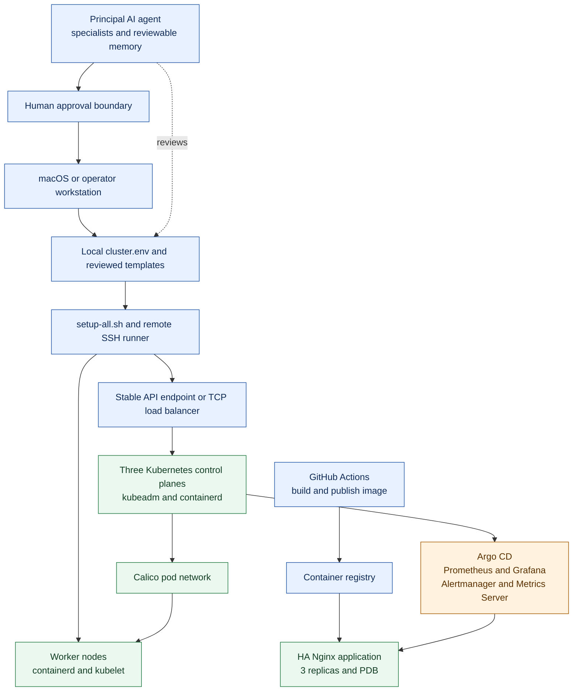

# Kubernetes Platform Architecture

## Flow ownership

- The operator reviews configuration and starts the Mac or Linux orchestration path.
- The API endpoint load-balances requests across three control planes.
- Control planes schedule workloads onto workers through the Calico pod network.
- Argo CD and the monitoring stack are installed through local Helm values.
- GitHub Actions builds images and publishes them to the configured registry.
- The HA Nginx deployment uses replicas, probes, topology spreading, and a PodDisruptionBudget.
- The AI agent can advise and prepare proposals, but the human approval boundary prevents autonomous changes.